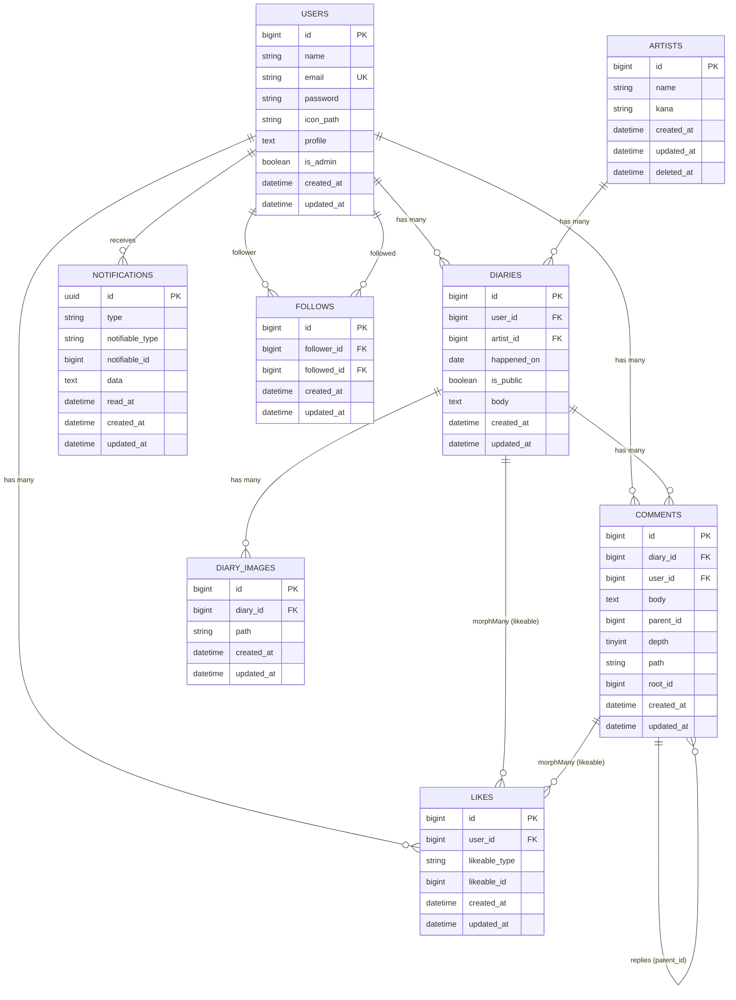

## 制作アプリのタイトル
Oshi Graphy （推しグラフィー）
## 制作アプリの説明
Oshi-Graphy（推しグラフィー）は、 
80〜90年代から今も活躍するアーティストの推し活を楽しむ中高年世代を対象にした 
推し活ダイアリー共有アプリです。 
ライブ参戦や日常の推し活を日記として残し、同じ世代の仲間と共有・交流できる場を提供します。
## 主な機能
- ダイアリー（公開／非公開、画像添付、推しアーティスト紐付け）
- コメント & いいね（ダイアリー／コメント）
- フォロー機能（ユーザー間の相互フォロー／フォロワー一覧）
- ユーザープロフィール（アイコン画像・自己紹介）
- 通知（既読管理、ベルの未読数、通知リスト／詳細リンク）
- アーティスト管理（管理者のみ：CRUD）
- ダッシュボード（通知一覧、クイックリンク）
- AIアシスト（日記下書き補助）※Gemini API 連携
- 検索 UI（Select2 などの補助 UI、一部ページで利用）
- レスポンシブデザイン、ダークモード対応
## 技術スタック
- Backend : Laravel 12, PHP 8.4
- DB : MySQL 8
- Frontend : Tailwind CSS / Alpine.js / Vite / Blade Components
- Auth : Laravel Breeze（JP ローカライズ）
- AI / API連携 : Gemini API ( Google Generative AI)
- Environment :
  - Docker / Laravel Sail ( ローカル開発環境 )
  - さくらレンタルサーバ ( 本番環境 PHP 8.3 )

## ER Diagram
主要エンティティのリレーション構造

